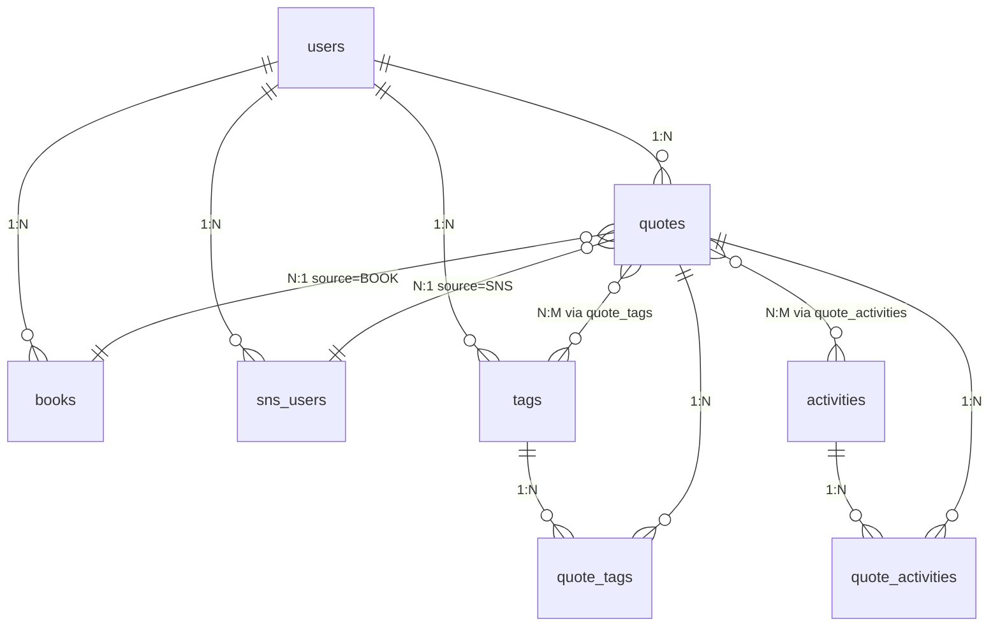

# データベース設計書 v2.0

## 1. 概要

### 1.1 使用データベース

- **PostgreSQL 15** (Supabase)
- 文字コード：UTF-8
- タイムゾーン：UTC

### 1.2 設計方針

- 正規化：第3正規形まで
- 論理削除：`deleted_at` カラムで管理
- タイムスタンプ：`created_at`, `updated_at` を全テーブルに配置
- Row Level Security（RLS）：Supabaseで有効化

---

## 2. ER図



---

## 3. テーブル定義

### 3.1 users（ユーザー）

**説明:** Supabase Authが管理。直接操作しない。

```sql
-- Supabase Authのテーブル（参照のみ）
-- auth.users
id UUID PRIMARY KEY
email TEXT
created_at TIMESTAMPTZ
```

---

### 3.2 activities（活動領域）

**説明:** システム固定の10個の活動領域マスタ。

```sql
CREATE TABLE activities (
  id SERIAL PRIMARY KEY,
  name TEXT NOT NULL UNIQUE,
  description TEXT,
  icon TEXT NOT NULL,
  display_order INT NOT NULL,
  created_at TIMESTAMPTZ NOT NULL DEFAULT now()
);

-- 初期データ
INSERT INTO activities (id, name, description, icon, display_order) VALUES
(1, '仕事・キャリア', '業務、スキル開発、キャリア形成に関連する活動', '💼', 1),
(2, '学習・研究', '勉強、調査、知識習得に関する活動', '📖', 2),
(3, '創作・制作活動', '執筆、プログラミング、デザイン、工作等', '🎨', 3),
(4, '趣味・娯楽', 'ゲーム、音楽鑑賞、映画、コレクション等', '🎮', 4),
(5, '運動・身体活動', 'スポーツ、トレーニング、散歩等', '🏃', 5),
(6, '読書・情報収集', '本、記事、SNS、ニュース等の閲覧', '📚', 6),
(7, '人間関係・コミュニケーション', '家族、友人、同僚との関わり', '👥', 7),
(8, '生活習慣・セルフケア', '睡眠、食事、メンタルケア、環境整備', '🌱', 8),
(9, '社会活動・貢献', 'ボランティア、地域活動、社会課題への取り組み', '🤝', 9),
(10, 'その他', '上記に当てはまらない活動', '📝', 10);

CREATE INDEX activities_display_order_idx ON activities(display_order);
```

**カラム説明:**

| カラム名 | 型 | NULL | デフォルト | 説明 |
|---------|-----|------|-----------|------|
| id | SERIAL | NOT NULL | - | 活動領域ID（固定） |
| name | TEXT | NOT NULL | - | 活動領域名 |
| description | TEXT | NULL | - | 説明 |
| icon | TEXT | NOT NULL | - | アイコン（絵文字） |
| display_order | INT | NOT NULL | - | 表示順序 |
| created_at | TIMESTAMPTZ | NOT NULL | now() | 作成日時 |

---

### 3.3 books（書籍）

**説明:** フレーズの出典となる書籍情報。

```sql
CREATE TABLE books (
  id BIGSERIAL PRIMARY KEY,
  user_id UUID NOT NULL REFERENCES auth.users(id) ON DELETE CASCADE,
  title TEXT NOT NULL,
  author TEXT NOT NULL,
  cover_image_url TEXT,
  isbn TEXT,
  asin TEXT,
  publisher TEXT,
  publication_date DATE,
  created_at TIMESTAMPTZ NOT NULL DEFAULT now(),
  updated_at TIMESTAMPTZ NOT NULL DEFAULT now(),
  deleted_at TIMESTAMPTZ,
  UNIQUE(user_id, title, author)
);

CREATE INDEX books_user_idx ON books(user_id) WHERE deleted_at IS NULL;
CREATE INDEX books_title_idx ON books(title) WHERE deleted_at IS NULL;
CREATE INDEX books_isbn_idx ON books(isbn) WHERE deleted_at IS NULL AND isbn IS NOT NULL;
CREATE INDEX books_asin_idx ON books(asin) WHERE deleted_at IS NULL AND asin IS NOT NULL;

-- RLS有効化
ALTER TABLE books ENABLE ROW LEVEL SECURITY;

-- ポリシー：ユーザーは自分のデータのみアクセス可能
CREATE POLICY books_policy ON books
  USING (auth.uid() = user_id);
```

**カラム説明:**

| カラム名 | 型 | NULL | デフォルト | 説明 |
|---------|-----|------|-----------|------|
| id | BIGSERIAL | NOT NULL | - | 書籍ID |
| user_id | UUID | NOT NULL | - | ユーザーID（Supabase Auth） |
| title | TEXT | NOT NULL | - | 書籍タイトル |
| author | TEXT | NOT NULL | - | 著者名 |
| cover_image_url | TEXT | NULL | - | 書籍カバー画像URL |
| isbn | TEXT | NULL | - | ISBN（国際標準図書番号） |
| asin | TEXT | NULL | - | Amazon ASIN |
| publisher | TEXT | NULL | - | 出版社 |
| publication_date | DATE | NULL | - | 出版日 |
| created_at | TIMESTAMPTZ | NOT NULL | now() | 作成日時 |
| updated_at | TIMESTAMPTZ | NOT NULL | now() | 更新日時 |
| deleted_at | TIMESTAMPTZ | NULL | - | 削除日時（論理削除） |

**制約:**

- `UNIQUE(user_id, title, author)`: 同じユーザーが同じ書籍を重複登録できない

---

### 3.4 sns_users（SNSユーザー）

**説明:** フレーズの出典となるSNSユーザー情報。

```sql
CREATE TABLE sns_users (
  id BIGSERIAL PRIMARY KEY,
  user_id UUID NOT NULL REFERENCES auth.users(id) ON DELETE CASCADE,
  platform TEXT NOT NULL CHECK (platform IN ('X', 'THREADS')),
  handle TEXT NOT NULL,
  display_name TEXT,
  created_at TIMESTAMPTZ NOT NULL DEFAULT now(),
  updated_at TIMESTAMPTZ NOT NULL DEFAULT now(),
  deleted_at TIMESTAMPTZ,
  UNIQUE(user_id, platform, handle)
);

CREATE INDEX sns_users_user_idx ON sns_users(user_id) WHERE deleted_at IS NULL;
CREATE INDEX sns_users_handle_idx ON sns_users(handle) WHERE deleted_at IS NULL;
CREATE INDEX sns_users_platform_idx ON sns_users(platform) WHERE deleted_at IS NULL;

-- RLS有効化
ALTER TABLE sns_users ENABLE ROW LEVEL SECURITY;

-- ポリシー
CREATE POLICY sns_users_policy ON sns_users
  USING (auth.uid() = user_id);
```

**カラム説明:**

| カラム名 | 型 | NULL | デフォルト | 説明 |
|---------|-----|------|-----------|------|
| id | BIGSERIAL | NOT NULL | - | SNSユーザーID |
| user_id | UUID | NOT NULL | - | ユーザーID（Supabase Auth） |
| platform | TEXT | NOT NULL | - | プラットフォーム（X, THREADS） |
| handle | TEXT | NOT NULL | - | ユーザーID（@は含まない） |
| display_name | TEXT | NULL | - | 表示名（ユーザー名） |
| created_at | TIMESTAMPTZ | NOT NULL | now() | 作成日時 |
| updated_at | TIMESTAMPTZ | NOT NULL | now() | 更新日時 |
| deleted_at | TIMESTAMPTZ | NULL | - | 削除日時（論理削除） |

**制約:**

- `CHECK (platform IN ('X', 'THREADS'))`: プラットフォームは X または THREADS のみ
- `UNIQUE(user_id, platform, handle)`: 同じユーザーが同じプラットフォーム・ハンドルを重複登録できない

**将来の拡張:**

```sql
-- 新しいプラットフォームを追加する場合
ALTER TABLE sns_users
  DROP CONSTRAINT sns_users_platform_check,
  ADD CONSTRAINT sns_users_platform_check
    CHECK (platform IN ('X', 'THREADS', 'BLUESKY', 'MASTODON'));
```

---

### 3.5 tags（タグ）

**説明:** フレーズに付与するユーザー定義タグ。

```sql
CREATE TABLE tags (
  id BIGSERIAL PRIMARY KEY,
  user_id UUID NOT NULL REFERENCES auth.users(id) ON DELETE CASCADE,
  name TEXT NOT NULL,
  created_at TIMESTAMPTZ NOT NULL DEFAULT now(),
  updated_at TIMESTAMPTZ NOT NULL DEFAULT now(),
  deleted_at TIMESTAMPTZ,
  UNIQUE(user_id, name)
);

CREATE INDEX tags_user_idx ON tags(user_id) WHERE deleted_at IS NULL;
CREATE INDEX tags_name_idx ON tags(name) WHERE deleted_at IS NULL;

-- RLS有効化
ALTER TABLE tags ENABLE ROW LEVEL SECURITY;

-- ポリシー
CREATE POLICY tags_policy ON tags
  USING (auth.uid() = user_id);
```

**カラム説明:**

| カラム名 | 型 | NULL | デフォルト | 説明 |
|---------|-----|------|-----------|------|
| id | BIGSERIAL | NOT NULL | - | タグID |
| user_id | UUID | NOT NULL | - | ユーザーID（Supabase Auth） |
| name | TEXT | NOT NULL | - | タグ名（#含む） |
| created_at | TIMESTAMPTZ | NOT NULL | now() | 作成日時 |
| updated_at | TIMESTAMPTZ | NOT NULL | now() | 更新日時 |
| deleted_at | TIMESTAMPTZ | NULL | - | 削除日時（論理削除） |

**制約:**

- `UNIQUE(user_id, name)`: 同じユーザーが同じタグ名を重複作成できない

---

### 3.6 quotes（フレーズ）

**説明:** ユーザーが登録するフレーズ本体。

```sql
CREATE TABLE quotes (
  id BIGSERIAL PRIMARY KEY,
  user_id UUID NOT NULL REFERENCES auth.users(id) ON DELETE CASCADE,
  text TEXT NOT NULL,
  source_type TEXT NOT NULL CHECK (source_type IN ('BOOK', 'SNS', 'OTHER')),
  book_id BIGINT REFERENCES books(id) ON DELETE CASCADE,
  sns_user_id BIGINT REFERENCES sns_users(id) ON DELETE CASCADE,
  page_number INT,
  source_meta JSONB,
  created_at TIMESTAMPTZ NOT NULL DEFAULT now(),
  updated_at TIMESTAMPTZ NOT NULL DEFAULT now(),
  deleted_at TIMESTAMPTZ,
  CONSTRAINT source_check CHECK (
    (source_type = 'BOOK' AND book_id IS NOT NULL AND sns_user_id IS NULL) OR
    (source_type = 'SNS' AND sns_user_id IS NOT NULL AND book_id IS NULL) OR
    (source_type = 'OTHER' AND book_id IS NULL AND sns_user_id IS NULL)
  )
);

CREATE INDEX quotes_user_idx ON quotes(user_id) WHERE deleted_at IS NULL;
CREATE INDEX quotes_source_type_idx ON quotes(source_type) WHERE deleted_at IS NULL;
CREATE INDEX quotes_book_idx ON quotes(book_id) WHERE deleted_at IS NULL;
CREATE INDEX quotes_sns_user_idx ON quotes(sns_user_id) WHERE deleted_at IS NULL;
CREATE INDEX quotes_created_idx ON quotes(created_at DESC) WHERE deleted_at IS NULL;
CREATE INDEX quotes_text_idx ON quotes USING gin(to_tsvector('japanese', text)) WHERE deleted_at IS NULL;

-- RLS有効化
ALTER TABLE quotes ENABLE ROW LEVEL SECURITY;

-- ポリシー
CREATE POLICY quotes_policy ON quotes
  USING (auth.uid() = user_id);
```

**カラム説明:**

| カラム名 | 型 | NULL | デフォルト | 説明 |
|---------|-----|------|-----------|------|
| id | BIGSERIAL | NOT NULL | - | フレーズID |
| user_id | UUID | NOT NULL | - | ユーザーID（Supabase Auth） |
| text | TEXT | NOT NULL | - | フレーズ本文 |
| source_type | TEXT | NOT NULL | - | 出典タイプ（BOOK, SNS, OTHER） |
| book_id | BIGINT | NULL | - | 書籍ID（source_type='BOOK'の場合） |
| sns_user_id | BIGINT | NULL | - | SNSユーザーID（source_type='SNS'の場合） |
| page_number | INT | NULL | - | ページ番号（書籍の場合） |
| source_meta | JSONB | NULL | - | 追加の出典情報（JSONで保存） |
| created_at | TIMESTAMPTZ | NOT NULL | now() | 作成日時（フレーズ登録日時） |
| updated_at | TIMESTAMPTZ | NOT NULL | now() | 更新日時 |
| deleted_at | TIMESTAMPTZ | NULL | - | 削除日時（論理削除） |

**制約:**

- `CHECK (source_type IN ('BOOK', 'SNS', 'OTHER'))`: 出典タイプは3種類のみ
- `source_check`: 出典タイプに応じて適切な外部キーが設定されていることを保証

**source_metaの構造:**

```json
// BOOK
{
  "page": 27
}

// SNS - 特になし（将来的に投稿日時など保存可能）
{}

// OTHER
{
  "source": "社内研修",
  "note": "10月の全社研修での気づき"
}
```

---

### 3.7 quote_activities（フレーズ-活動領域 中間テーブル）

**説明:** フレーズと活動領域の多対多関係を管理。

```sql
CREATE TABLE quote_activities (
  id BIGSERIAL PRIMARY KEY,
  quote_id BIGINT NOT NULL REFERENCES quotes(id) ON DELETE CASCADE,
  activity_id INT NOT NULL REFERENCES activities(id) ON DELETE CASCADE,
  created_at TIMESTAMPTZ NOT NULL DEFAULT now(),
  UNIQUE(quote_id, activity_id)
);

CREATE INDEX quote_activities_quote_idx ON quote_activities(quote_id);
CREATE INDEX quote_activities_activity_idx ON quote_activities(activity_id);

-- RLS有効化
ALTER TABLE quote_activities ENABLE ROW LEVEL SECURITY;

-- ポリシー：quotes経由でアクセス制御
CREATE POLICY quote_activities_policy ON quote_activities
  USING (
    EXISTS (
      SELECT 1 FROM quotes
      WHERE quotes.id = quote_activities.quote_id
      AND quotes.user_id = auth.uid()
    )
  );
```

**カラム説明:**

| カラム名 | 型 | NULL | デフォルト | 説明 |
|---------|-----|------|-----------|------|
| id | BIGSERIAL | NOT NULL | - | ID |
| quote_id | BIGINT | NOT NULL | - | フレーズID |
| activity_id | INT | NOT NULL | - | 活動領域ID |
| created_at | TIMESTAMPTZ | NOT NULL | now() | 作成日時 |

**制約:**

- `UNIQUE(quote_id, activity_id)`: 同じフレーズに同じ活動領域を重複して付与できない

---

### 3.8 quote_tags（フレーズ-タグ 中間テーブル）

**説明:** フレーズとタグの多対多関係を管理。

```sql
CREATE TABLE quote_tags (
  id BIGSERIAL PRIMARY KEY,
  quote_id BIGINT NOT NULL REFERENCES quotes(id) ON DELETE CASCADE,
  tag_id BIGINT NOT NULL REFERENCES tags(id) ON DELETE CASCADE,
  created_at TIMESTAMPTZ NOT NULL DEFAULT now(),
  UNIQUE(quote_id, tag_id)
);

CREATE INDEX quote_tags_quote_idx ON quote_tags(quote_id);
CREATE INDEX quote_tags_tag_idx ON quote_tags(tag_id);

-- RLS有効化
ALTER TABLE quote_tags ENABLE ROW LEVEL SECURITY;

-- ポリシー：quotes経由でアクセス制御
CREATE POLICY quote_tags_policy ON quote_tags
  USING (
    EXISTS (
      SELECT 1 FROM quotes
      WHERE quotes.id = quote_tags.quote_id
      AND quotes.user_id = auth.uid()
    )
  );
```

**カラム説明:**

| カラム名 | 型 | NULL | デフォルト | 説明 |
|---------|-----|------|-----------|------|
| id | BIGSERIAL | NOT NULL | - | ID |
| quote_id | BIGINT | NOT NULL | - | フレーズID |
| tag_id | BIGINT | NOT NULL | - | タグID |
| created_at | TIMESTAMPTZ | NOT NULL | now() | 作成日時 |

**制約:**

- `UNIQUE(quote_id, tag_id)`: 同じフレーズに同じタグを重複して付与できない

---

## 4. ビュー

### 4.1 quotes_with_details（フレーズ詳細ビュー）

**説明:** フレーズと関連情報を結合したビュー。頻繁に使用するJOINをまとめる。

```sql
CREATE VIEW quotes_with_details AS
SELECT
  q.id,
  q.user_id,
  q.text,
  q.source_type,
  q.page_number,
  q.source_meta,
  q.created_at,
  q.updated_at,
  -- 書籍情報
  b.id AS book_id,
  b.title AS book_title,
  b.author AS book_author,
  b.cover_image_url AS book_cover_image_url,
  -- SNSユーザー情報
  s.id AS sns_user_id,
  s.platform AS sns_platform,
  s.handle AS sns_handle,
  s.display_name AS sns_display_name,
  -- 活動領域（配列）
  ARRAY_AGG(DISTINCT a.id) FILTER (WHERE a.id IS NOT NULL) AS activity_ids,
  ARRAY_AGG(DISTINCT a.name || ' ' || a.icon) FILTER (WHERE a.id IS NOT NULL) AS activity_names,
  -- タグ（配列）
  ARRAY_AGG(DISTINCT t.id) FILTER (WHERE t.id IS NOT NULL) AS tag_ids,
  ARRAY_AGG(DISTINCT t.name) FILTER (WHERE t.id IS NOT NULL) AS tag_names
FROM quotes q
LEFT JOIN books b ON q.book_id = b.id AND b.deleted_at IS NULL
LEFT JOIN sns_users s ON q.sns_user_id = s.id AND s.deleted_at IS NULL
LEFT JOIN quote_activities qa ON q.id = qa.quote_id
LEFT JOIN activities a ON qa.activity_id = a.id
LEFT JOIN quote_tags qt ON q.id = qt.quote_id
LEFT JOIN tags t ON qt.tag_id = t.id AND t.deleted_at IS NULL
WHERE q.deleted_at IS NULL
GROUP BY
  q.id, q.user_id, q.text, q.source_type, q.page_number, q.source_meta,
  q.created_at, q.updated_at,
  b.id, b.title, b.author, b.cover_image_url,
  s.id, s.platform, s.handle, s.display_name;
```

---

## 5. トリガー

### 5.1 updated_at自動更新

**説明:** レコード更新時に `updated_at` を自動更新。

```sql
-- トリガー関数
CREATE OR REPLACE FUNCTION update_updated_at_column()
RETURNS TRIGGER AS $$
BEGIN
  NEW.updated_at = now();
  RETURN NEW;
END;
$$ LANGUAGE plpgsql;

-- 各テーブルにトリガーを設定
CREATE TRIGGER update_books_updated_at BEFORE UPDATE ON books
  FOR EACH ROW EXECUTE FUNCTION update_updated_at_column();

CREATE TRIGGER update_sns_users_updated_at BEFORE UPDATE ON sns_users
  FOR EACH ROW EXECUTE FUNCTION update_updated_at_column();

CREATE TRIGGER update_tags_updated_at BEFORE UPDATE ON tags
  FOR EACH ROW EXECUTE FUNCTION update_updated_at_column();

CREATE TRIGGER update_quotes_updated_at BEFORE UPDATE ON quotes
  FOR EACH ROW EXECUTE FUNCTION update_updated_at_column();
```

---

## 6. クエリ例

### 6.1 フレーズ一覧取得（グループ化）

```sql
-- 書籍ごとにグループ化
SELECT
  b.id AS book_id,
  b.title,
  b.author,
  b.cover_image_url,
  json_agg(
    json_build_object(
      'id', q.id,
      'text', q.text,
      'page_number', q.page_number,
      'activities', q.activity_names,
      'tags', q.tag_names,
      'created_at', q.created_at
    )
  ) AS quotes
FROM quotes_with_details q
JOIN books b ON q.book_id = b.id
WHERE q.user_id = 'xxx-xxx-xxx'
  AND q.source_type = 'BOOK'
GROUP BY b.id, b.title, b.author, b.cover_image_url
ORDER BY MAX(q.created_at) DESC;

-- SNSユーザーごとにグループ化
SELECT
  s.id AS sns_user_id,
  s.platform,
  s.handle,
  s.display_name,
  json_agg(
    json_build_object(
      'id', q.id,
      'text', q.text,
      'activities', q.activity_names,
      'tags', q.tag_names,
      'created_at', q.created_at
    )
  ) AS quotes
FROM quotes_with_details q
JOIN sns_users s ON q.sns_user_id = s.id
WHERE q.user_id = 'xxx-xxx-xxx'
  AND q.source_type = 'SNS'
GROUP BY s.id, s.platform, s.handle, s.display_name
ORDER BY MAX(q.created_at) DESC;
```

### 6.2 キーワード検索

```sql
SELECT * FROM quotes_with_details
WHERE user_id = 'xxx-xxx-xxx'
  AND (
    text ILIKE '%検索キーワード%'
    OR book_title ILIKE '%検索キーワード%'
    OR book_author ILIKE '%検索キーワード%'
    OR sns_display_name ILIKE '%検索キーワード%'
  )
ORDER BY created_at DESC;
```

### 6.3 活動領域フィルター

```sql
SELECT * FROM quotes_with_details
WHERE user_id = 'xxx-xxx-xxx'
  AND activity_ids @> ARRAY[1, 2]  -- 活動領域ID 1 または 2 を含む
ORDER BY created_at DESC;
```

### 6.4 タグフィルター

```sql
SELECT * FROM quotes_with_details
WHERE user_id = 'xxx-xxx-xxx'
  AND tag_ids @> ARRAY[10, 20]  -- タグID 10 または 20 を含む
ORDER BY created_at DESC;
```

### 6.5 タグ統合

```sql
-- タグID 123 を タグID 456 に統合
BEGIN;

-- quote_tagsを更新
UPDATE quote_tags
SET tag_id = 456
WHERE tag_id = 123
ON CONFLICT (quote_id, tag_id) DO NOTHING;  -- 重複は無視

-- 古いタグを削除
UPDATE tags
SET deleted_at = now()
WHERE id = 123;

COMMIT;
```

---

## 7. パフォーマンスチューニング

### 7.1 インデックス戦略

- 全文検索：`quotes.text` に GIN インデックス
- 外部キー：すべての外部キーにインデックス
- 検索条件：`deleted_at IS NULL` を含むインデックス
- ソート：`created_at DESC` のインデックス

### 7.2 N+1問題対策

- ビュー `quotes_with_details` を使用してJOINを事前実行
- フロントエンドでのグループ化処理

### 7.3 論理削除の影響

- 全クエリに `WHERE deleted_at IS NULL` を含める
- 部分インデックスで削除済みデータを除外

---

## 8. バックアップ戦略

### 8.1 Supabaseの自動バックアップ

- 無料プラン：7日間のバックアップ
- Proプラン：30日間のバックアップ

### 8.2 手動バックアップ

```bash
# PostgreSQLダンプ
pg_dump -h db.xxx.supabase.co -U postgres -d postgres > backup.sql

# 復元
psql -h db.xxx.supabase.co -U postgres -d postgres < backup.sql
```

---

## 9. マイグレーション管理

### 9.1 ツール

- Supabase CLI
- または手動SQLスクリプト

### 9.2 マイグレーションファイル例

```sql
-- 001_create_initial_schema.sql
-- 002_add_activities_table.sql
-- 003_add_sns_users_table.sql
```

---

## 10. セキュリティ

### 10.1 Row Level Security（RLS）

- すべてのテーブルでRLSを有効化
- ユーザーは自分のデータのみアクセス可能

### 10.2 暗号化

- Supabaseが提供する暗号化（at rest, in transit）

---

## 11. 変更履歴

| バージョン | 日付 | 変更内容 | 担当者 |
|-----------|------|----------|--------|
| 1.0 | 2024-10-27 | 初版作成 | - |
| 2.0 | 2024-10-27 | 活動領域を10個に固定、profile_image_url削除、アイコン画像不要 | - |
